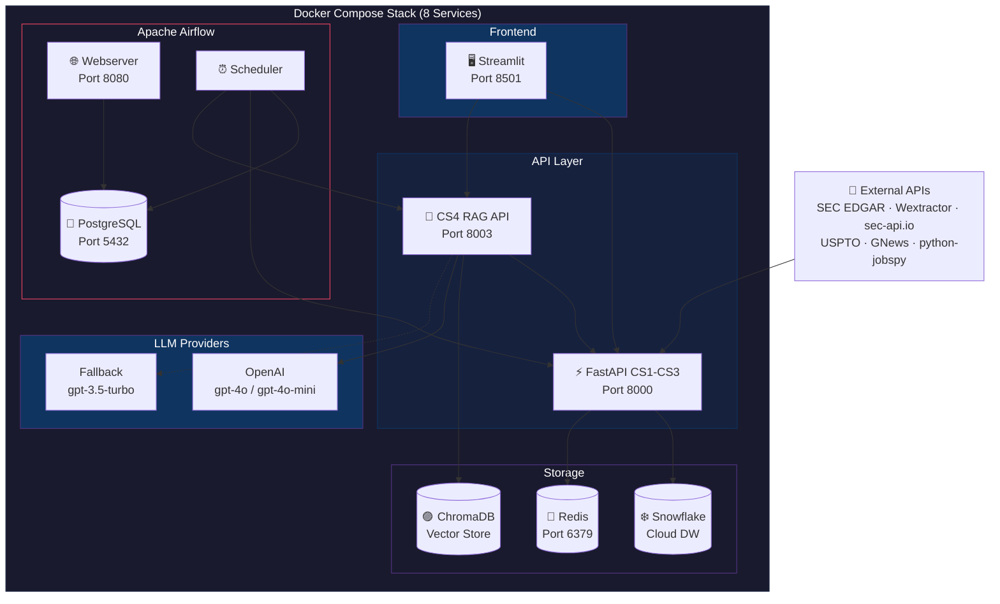
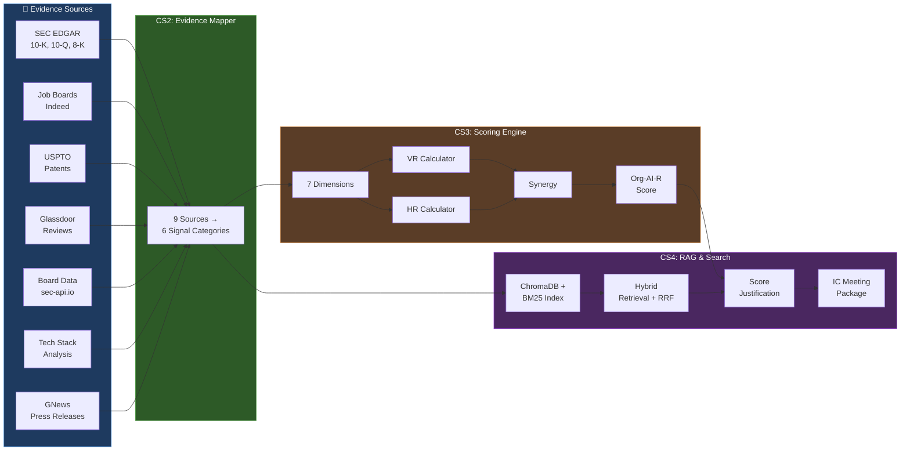
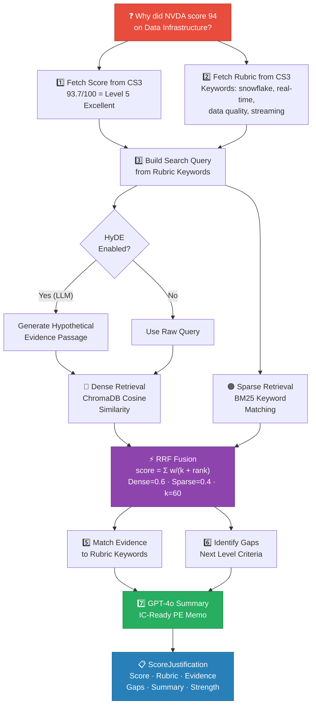
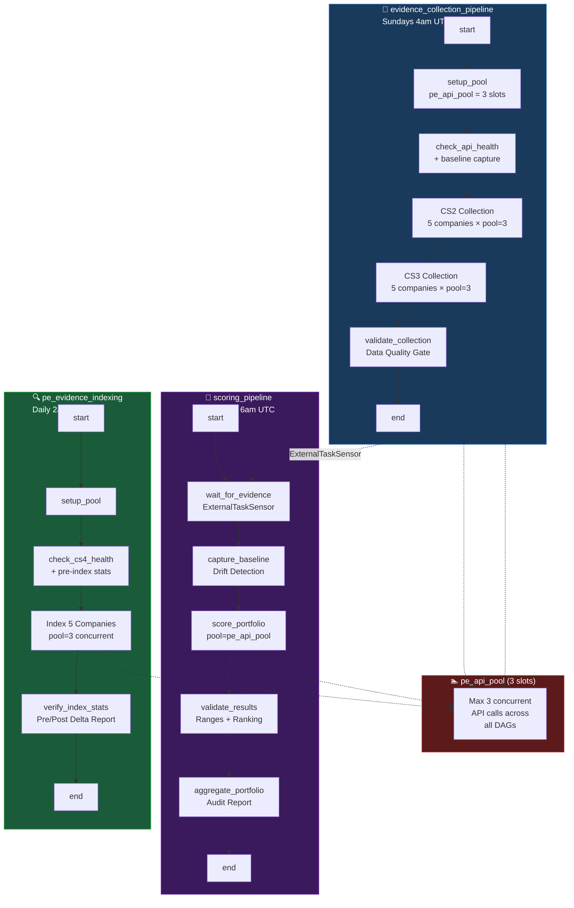
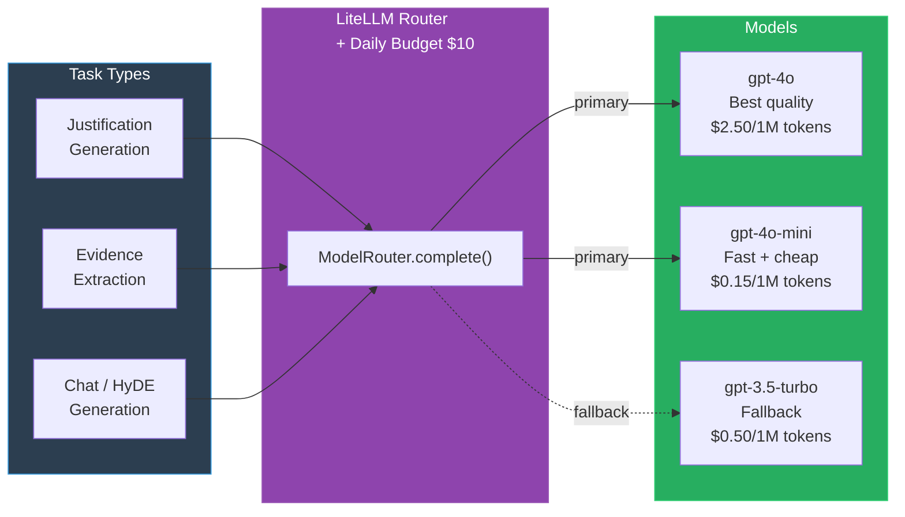

# PE Org-AI-R Platform

**AI-Readiness Assessment Platform for Private Equity Portfolio Companies**

[](https://python.org)
[](https://fastapi.tiangolo.com)
[]()
[]()

---

## Links

| Resource | URL |
|----------|-----|
| **Codelabs Document** | https://codelabs-preview.appspot.com/?file_id=1ZYVD62sCK0jvl3ffeBwXGa9qtkbn3vXAYPjzNQhwtow#0 |
| **Video Presentation** | https://youtu.be/2NXjSDy71eM |
| **Live Application** | http://54.172.44.67:8501 |

---

## Project Overview

The PE Org-AI-R platform enables private equity firms to systematically assess the AI-readiness of portfolio companies using a data-driven scoring framework. It collects evidence from 9 real data sources, maps them to 7 AI-readiness dimensions, produces calibrated Org-AI-R scores with confidence intervals, and generates **cited score justifications** for Investment Committee review via a hybrid RAG pipeline.

### Case Studies Implemented

| Case Study | Focus | Key Components |
|------------|-------|---------------|
| **CS1** | API & Database Design | FastAPI REST API, Snowflake schema, Redis caching, Pydantic models |
| **CS2** | Evidence Collection | SEC EDGAR filings, job postings, patents, tech stack signals |
| **CS3** | AI Scoring Engine | Evidence mapper, rubric scorer, VR/HR/Synergy calculations, 5-company portfolio |
| **CS4** | RAG & Search | Hybrid retrieval (Dense+BM25+RRF), LLM-powered score justifications, IC meeting prep, analyst notes |

**Course**: DAMG 7245 — Big Data and Intelligent Analytics (Spring 2026)

### Tech Stack

| Layer | Technology |
|-------|-----------|
| **Backend API** | Python 3.12, FastAPI, Pydantic v2 |
| **CS4 RAG API** | FastAPI (port 8003), LiteLLM, ChromaDB, sentence-transformers, BM25 |
| **Database** | Snowflake (cloud data warehouse) |
| **Vector Store** | ChromaDB (persistent, cosine similarity, metadata filtering) |
| **Embeddings** | sentence-transformers (all-MiniLM-L6-v2, 384-dim) |
| **LLM Routing** | LiteLLM (100+ providers, automatic fallbacks, cost tracking) |
| **Cache** | Redis 7 (Alpine) |
| **Frontend** | Streamlit 1.54, Plotly |
| **Orchestration** | Apache Airflow 2.8 (with pool-based concurrency control) |
| **Containerization** | Docker Compose (8 services) |
| **Testing** | Pytest, Hypothesis (property-based) |
| **External APIs** | SEC EDGAR, Wextractor (Glassdoor), sec-api.io (Board), USPTO PatentsView, GNews, python-jobspy |

---

## Architecture

### Docker Compose Stack



### Complete Data Pipeline (CS1 → CS2 → CS3 → CS4)



### CS4 RAG Justification Pipeline



### Airflow DAG Dependencies & Pool Control



### LLM Multi-Model Routing (Task 7.1)



---

## Portfolio Results

| Company | Sector | Org-AI-R | VR | HR | Synergy | 95% CI | Expected | Status |
|---------|--------|----------|------|------|---------|--------|----------|--------|
| **NVIDIA** | Technology | **81.73** | 78.35 | 92.04 | 66.32 | [78.8, 84.7] | 85-95 | CI overlaps |
| **Walmart** | Retail | **66.98** | 66.13 | 75.22 | 46.54 | [64.0, 69.9] | 55-65 | Above by ~2 |
| **JPMorgan** | Financial | **63.06** | 55.18 | 83.87 | 36.73 | [60.1, 66.0] | 65-75 | CI overlaps |
| **GE** | Manufacturing | **59.66** | 55.50 | 74.22 | 35.25 | [56.7, 62.6] | 45-55 | Above by ~5 |
| **Dollar General** | Retail | **46.74** | 39.28 | 67.22 | 19.48 | [43.8, 49.7] | 35-45 | Above by ~2 |

*Ranking: NVDA > WMT > JPM > GE > DG ✓*

### CS4 IC Recommendation (NVDA Example)

| Field | Value |
|-------|-------|
| **Recommendation** | 🟢 PROCEED — Strong AI readiness with solid evidence base |
| **Org-AI-R** | 81.7 (VR=78.3, HR=92.0) |
| **Key Strengths** | Data Infrastructure (Level 5), Technology Stack (Level 5), AI Governance (Level 4) |
| **Key Gaps** | No evidence of CAIO, CDO, CTO AI roles |
| **Risk Factors** | No major risk factors identified |
| **Total Evidence** | 5,088 indexed documents (SEC chunks + Glassdoor + Board + News + Jobs) |

---

## Directory Structure

```
pe-org-air-platform/
├── app/                                 # CS1–CS3 Backend
│   ├── main.py                          # FastAPI application entry point
│   ├── config.py                        # Pydantic settings (env-based)
│   ├── models/                          # Pydantic data models
│   ├── routers/                         # FastAPI API endpoints
│   │   ├── health.py                    # GET /health
│   │   ├── companies.py                 # CRUD /api/v1/companies
│   │   ├── assessments.py               # CRUD /api/v1/assessments
│   │   ├── documents.py                 # CRUD /api/v1/documents
│   │   ├── signals.py                   # CRUD /api/v1/signals + /evidence
│   │   ├── rubrics.py                   # GET /api/v1/rubrics/{dimension}
│   │   └── pipeline.py                  # Pipeline execution & orchestration
│   ├── services/                        # Snowflake ORM, Redis cache, S3
│   ├── pipelines/                       # SEC EDGAR, Jobs, Patents, Glassdoor, Board, News
│   └── scoring/                         # CS3: Evidence mapper → Rubric → VR/HR/Synergy → Org-AI-R
│
├── src/                                 # CS4 RAG & Search
│   ├── config.py                        # CS4 settings (LLM config, retrieval tuning)
│   ├── services/
│   │   ├── integration/                 # CS1/CS2/CS3 API Clients
│   │   │   ├── cs1_client.py            # Company metadata (ticker → UUID resolution)
│   │   │   ├── cs2_client.py            # Evidence loader (Snowflake + local JSON enrichment)
│   │   │   └── cs3_client.py            # Scoring client (scores, rubrics, local fallback)
│   │   ├── llm/router.py               # LiteLLM multi-provider router + budget tracking
│   │   ├── search/vector_store.py       # ChromaDB with metadata filtering
│   │   ├── retrieval/
│   │   │   ├── dimension_mapper.py      # Signal → Dimension mapping (PDF Table 1)
│   │   │   ├── hybrid.py               # Dense + BM25 + RRF fusion
│   │   │   └── hyde.py                  # Hypothetical Document Embeddings
│   │   ├── justification/generator.py   # Score justification with cited evidence
│   │   ├── workflows/ic_prep.py         # IC meeting prep (asyncio.gather, 7 dims)
│   │   └── collection/analyst_notes.py  # DD evidence collector (4 note types)
│   └── api/                             # CS4 FastAPI endpoints
│       ├── search.py                    # Search, index, stats, LLM status
│       └── justification.py             # Justification, IC prep, analyst notes
│
├── cs4_api.py                           # CS4 FastAPI app (port 8003)
├── streamlit_app.py                     # 14-page Streamlit dashboard
├── airflow/dags/                        # 3 DAGs with pool-based concurrency
│   ├── evidence_collection_dag.py       # CS2+CS3 collection (pool-limited)
│   ├── scoring_pipeline_dag.py          # Scoring + validation + drift detection
│   └── evidence_indexing_dag.py         # CS4 nightly indexing (pool-limited)
├── tests/                               # 255+ tests (CS1-CS4)
├── docker/
│   ├── compose.yaml                     # 8-service Docker Compose
│   ├── Dockerfile                       # FastAPI container
│   ├── Dockerfile.cs4                   # CS4 RAG API container
│   └── Dockerfile.streamlit             # Streamlit container
├── results/                             # Portfolio scoring outputs (JSON)
├── data/                                # Cached evidence (Glassdoor, Board, News)
└── chroma_data/                         # ChromaDB persistent vector store
```

---

## Setup Instructions

### Option 1: Docker Compose (Recommended)

```bash
# 1. Clone and configure
git clone <repository-url>
cd BigDataIA-SPring26-Team-4-case-study-4
cp .env.example .env
# Edit .env with Snowflake credentials, API keys, and OpenAI key

# 2. Build and start all 8 services
cd docker
docker compose up --build -d

# 3. Access applications
# Streamlit:     http://localhost:8501
# CS3 API Docs:  http://localhost:8000/docs
# CS4 RAG Docs:  http://localhost:8003/docs
# Airflow:       http://localhost:8080 (admin/admin)

# 4. Stop
docker compose down
```

### Option 2: Local Development

```bash
# 1. Install and configure
poetry install
cp .env.example .env  # Add credentials

# 2. Start services (3 terminals)
poetry run uvicorn app.main:app --reload --port 8000      # Terminal 1: CS3
poetry run uvicorn cs4_api:app --reload --port 8003        # Terminal 2: CS4
poetry run streamlit run streamlit_app.py                   # Terminal 3: UI

# 3. Run tests
poetry run pytest -v
```

### CS4 LLM Configuration

```bash
# .env — multi-model routing for different task types
CS4_PRIMARY_MODEL=gpt-4o-mini
CS4_FALLBACK_MODEL=gpt-3.5-turbo
CS4_JUSTIFICATION_MODEL=gpt-4o          # Best quality for IC memos
CS4_EXTRACTION_MODEL=gpt-4o-mini        # Fast + cheap for extraction
CS4_CHAT_MODEL=gpt-4o-mini              # Lightweight for HyDE + chat
OPENAI_API_KEY=sk-...
CS4_DAILY_BUDGET_USD=10.0
```

---

## Scoring Formulas

**Org-AI-R** = (1 − β) · [α · VR + (1 − α) · HR] + β · Synergy

| Formula | Expression | Constants |
|---------|-----------|-----------|
| **VR** | D̄w × (1 − λ × cv_D) × TalentRiskAdj | λ = 0.25 |
| **HR** | HR_base × (1 + δ × PF) | δ = 0.15 |
| **PF** | 0.6 × VR_component + 0.4 × MCap_component | bounded [-1, 1] |
| **Synergy** | VR × HR / 100 × Alignment × TimingFactor | TimingFactor ∈ [0.8, 1.2] |
| **Final** | (1 − β) × [α × VR + (1 − α) × HR] + β × Synergy | α=0.60, β=0.12 |

### CS4 Hybrid Retrieval Parameters

| Parameter | Value | Configurable Via |
|-----------|-------|-----------------|
| Dense Weight | 0.60 | `CS4_DENSE_WEIGHT` |
| Sparse (BM25) Weight | 0.40 | `CS4_BM25_WEIGHT` |
| RRF Constant (k) | 60 | `CS4_RRF_K` |
| Embedding Model | all-MiniLM-L6-v2 (384-dim) | `CS4_EMBEDDING_MODEL` |
| Candidate Multiplier | 3× | Hardcoded |
| HyDE Enhancement | Auto (requires LLM) | Falls back to raw query |
| Daily Budget | $10.00 | `CS4_DAILY_BUDGET_USD` |
| Airflow Pool Slots | 3 concurrent | `pe_api_pool` |

---

## API Endpoints

### CS1/CS2/CS3 API (Port 8000)

| Router | Prefix | Purpose |
|--------|--------|---------|
| `health.py` | `/health` | Health check (Snowflake/Redis/S3) |
| `companies.py` | `/api/v1/companies` | Company CRUD + ticker lookup |
| `assessments.py` | `/api/v1/assessments` | Assessment lifecycle |
| `documents.py` | `/api/v1/documents` | SEC document CRUD + chunks |
| `signals.py` | `/api/v1/signals` | External signal CRUD + evidence stats |
| `rubrics.py` | `/api/v1/rubrics` | Dimension rubric criteria |
| `pipeline.py` | `/api/v1/pipeline` | Pipeline execution, scoring, weights |

### CS4 RAG API (Port 8003)

| Endpoint | Method | Purpose |
|----------|--------|---------|
| `/api/v1/search` | GET | Hybrid search with metadata filters |
| `/api/v1/index` | POST | Index company evidence → ChromaDB + BM25 |
| `/api/v1/index/stats` | GET | Indexing statistics |
| `/api/v1/llm/status` | GET | LLM providers, models, daily budget |
| `/api/v1/justification/{company}/{dim}` | GET | Score justification with cited evidence |
| `/api/v1/ic-prep/{company}` | GET | Full IC meeting package (7 dimensions) |
| `/api/v1/analyst-notes/*` | POST/GET | Submit & list analyst notes (4 types) |
| `/health` | GET | Service health check |

---

## Streamlit Dashboard (14 Pages)

### CS2/CS3 Pages

| Page | Features |
|------|----------|
| 📊 Portfolio Overview | KPI metrics, bar charts with CI, VR/HR/Synergy breakdown |
| 🔍 Company Deep Dive | 7-dimension radar chart, score decomposition |
| 📐 Dimension Analysis | Heatmap, cross-company comparison, radar overlay |
| 📡 CS2 Evidence Dashboard | Signal weights, evidence stats, composite recalculation |
| ⚖️ Signal Weight Configurator | Interactive sliders, live preview, persist to Snowflake |
| 🚀 Pipeline Control | Run pipelines via API, progress tracking, task history |
| 🧮 Scoring Methodology | Formulas, Sankey diagram, dimension weights |
| 📂 Evidence Explorer | Direct API calls, 6 evidence tabs (SEC, Glassdoor, Board, Jobs, News) |
| 🧪 Testing & Coverage | Run pytest from UI, coverage chart, property test details |

### CS4 RAG & Search Pages

| Page | Features |
|------|----------|
| 🔎 Evidence Search | Hybrid retrieval, company/dimension/source filters, score-badged expandable cards |
| 📋 Score Justification | Score card, rubric match, GPT-4o IC-ready summary, cited evidence, gap identification |
| 📑 IC Meeting Prep | Recommendation badge, executive summary, strengths/gaps/risks, 7-dimension justifications |
| 📝 Analyst Notes | 4 note types (Interview, DD Finding, Data Room, Meeting), real-time indexing |
| ⚙️ RAG Settings | Service health, LLM status + budget, evidence indexing, index stats, API reference |

---

## Airflow DAGs (Pool-Controlled)

All DAGs share `pe_api_pool` (3 slots) to prevent backend overload — scales safely to 20+ companies.

| DAG | Schedule | Pool | Key Features |
|-----|----------|------|-------------|
| `evidence_collection_pipeline` | Sundays 4am | ✅ 3 slots | CS2+CS3 collection → **data quality validation gate** |
| `scoring_pipeline` | Mondays 6am | ✅ 3 slots | ExternalTaskSensor → score → **range validation** → **drift detection** → audit report |
| `pe_evidence_indexing` | Daily 2am | ✅ 3 slots | Health check → index (pooled) → **pre/post delta verification** |

**Why Airflow over Streamlit?** Streamlit is interactive (click-to-run). Airflow adds: scheduled automation, pool concurrency control, dependency chains (ExternalTaskSensor), data quality gates, drift detection, SLA monitoring, retry with exponential backoff, and full audit trail.

---

## Testing

```bash
poetry run pytest -v                          # Full suite
poetry run pytest tests/test_cs4_*.py -v      # CS4 only
poetry run pytest --cov=app/scoring --cov=src  # With coverage
```

| Metric | Value |
|--------|-------|
| Total Tests | 255+ |
| CS3 Scoring Coverage | 97% |
| Hypothesis Property Tests | 6 × 500 examples |
| CS4 Test Files | 4 (integration, rag, workflows, api) |

---

## Team Member Contributions

| Member | Contributions |
|--------|--------------|
| **Deep Prajapati** | CS1 API design, CS2 evidence collection (SEC, jobs, patents, tech), CS3 scoring engine (all 11 components), Glassdoor/Board/News collectors, CS4 RAG pipeline (hybrid retrieval, HyDE, justification generator, IC prep workflow, analyst notes), Streamlit dashboard (14 pages), Docker Compose (8 services), Airflow DAGs (3 DAGs with pool control), full integration testing |
| **Tapan Patel** | Airflow DAG design reference, initial Docker setup |
| **Seamus McAvoy** | CS1 API foundation, initial Snowflake schema design, CS2 evidence pipeline contributions |

### AI Tools Used

| Tool | Usage |
|------|-------|
| **Claude (Anthropic)** | Code generation, debugging, architecture design, formula verification, test writing, RAG pipeline design |
| **GitHub Copilot** | Inline code suggestions |

---

## Deliverables Checklist

### Lab 5 — CS3 Scoring (50 points)
- ✅ Evidence Mapper with complete mapping table (10 pts)
- ✅ Rubric Scorer with all 7 dimension rubrics (8 pts)
- ✅ Glassdoor Culture Collector (7 pts)
- ✅ Board Composition Analyzer (7 pts)
- ✅ Talent Concentration Calculator (5 pts)
- ✅ Decimal utilities (3 pts)
- ✅ VR Calculator with audit logging (5 pts)
- ✅ Property-based tests (5 pts)

### Lab 6 — CS3 Portfolio (50 points)
- ✅ Position Factor Calculator (5 pts)
- ✅ Integration Service — full pipeline (15 pts)
- ✅ HR Calculator with δ = 0.15 (5 pts)
- ✅ SEM-based Confidence Calculator (5 pts)
- ✅ Synergy Calculator (5 pts)
- ✅ Org-AI-R Calculator (5 pts)
- ✅ 5-company portfolio results (10 pts)

### Lab 7 — CS4 Foundation & Integration (33 points)
- ✅ CS1 Company Client (5 pts)
- ✅ CS2 Evidence Schema & Loader (8 pts)
- ✅ CS3 Scoring API Client (7 pts)
- ✅ LiteLLM Multi-Provider Router (8 pts)
- ✅ Dimension Mapper (5 pts)

### Lab 8 — CS4 Hybrid RAG & PE Workflows (67 points)
- ✅ Hybrid Retrieval with RRF Fusion (10 pts)
- ✅ HyDE Query Enhancement (7 pts)
- ✅ Score Justification Generator (12 pts)
- ✅ IC Meeting Prep Workflow (10 pts)
- ✅ Analyst Notes Collector (8 pts)
- ✅ Search API with filters (8 pts)
- ✅ Justification API endpoint (7 pts)
- ✅ Unit & integration tests (5 pts)

### Extensions (+10 bonus)
- ✅ Airflow Evidence Indexing DAG with pool control (+5 pts)
- ✅ Docker Compose with CS4 RAG API service (+5 pts)

### Testing Requirements
- ✅ ≥80% code coverage (97% achieved on scoring)
- ✅ All property tests pass with 500 examples
- ✅ Portfolio scores validated against expected ranges
- ✅ CS4 tests cover integration, RAG, workflows, and API
