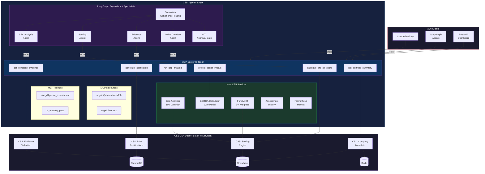
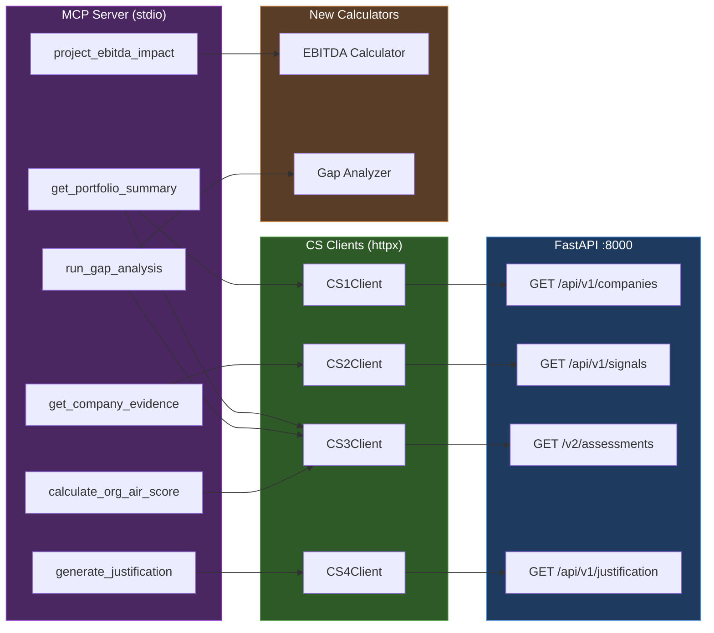
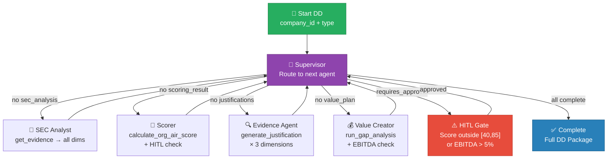
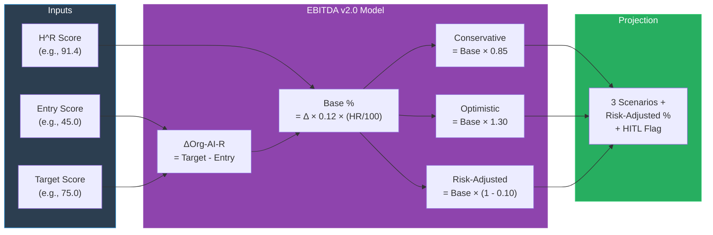

# CS5: Agentic Portfolio Intelligence

**MCP Server + LangGraph Agents + CS1-CS4 Integration**

[](https://python.org)
[](https://modelcontextprotocol.io)
[](https://github.com/langchain-ai/langgraph)
[]()

---

## Links

| Resource | URL |
|----------|-----|
| **Codelabs Document** | *TBD* |
| **Video Presentation** | *TBD* |
| **CS1-CS4 API Docs** | http://localhost:8000/docs |
| **Streamlit Dashboard** | http://localhost:8501 |

---

## Project Overview

CS5 transforms the CS1-CS4 PE Org-AI-R platform into an **intelligent agentic system**. It wraps all existing APIs as MCP (Model Context Protocol) tools and orchestrates complex PE workflows using LangGraph multi-agent pipelines with human-in-the-loop approval gates.

> *"Claude, prepare the IC meeting for NVIDIA."*

One prompt triggers a full due diligence workflow: score calculation, evidence retrieval, RAG-backed justifications across 7 dimensions, gap analysis, EBITDA projections, and a formatted Word document — all powered by real CS1-CS4 data.

**Key Rule:** NO mock data. All MCP tools call real CS1-CS4 services. Stopping Docker causes tools to error, not return hardcoded values.

**Course**: DAMG 7245 — Big Data and Intelligent Analytics (Spring 2026)

### Tech Stack

| Layer | Technology |
|-------|-----------|
| **MCP Server** | MCP SDK 1.26 (FastMCP), stdio transport |
| **Agent Framework** | LangGraph 1.1, LangChain OpenAI/Anthropic |
| **Backend (CS1-CS4)** | FastAPI, Snowflake, Redis, ChromaDB, LiteLLM |
| **Dashboard** | Streamlit 1.40, Plotly, nest-asyncio |
| **Observability** | Prometheus metrics (counters, histograms, decorators) |
| **Testing** | Pytest + pytest-asyncio, mock-based integration tests |
| **Package Manager** | uv (PEP 723 compliant) |
| **LLM Providers** | OpenAI (gpt-4o, gpt-4o-mini), Anthropic (claude-sonnet-4) |
| **Containerization** | Docker Compose (8 services for CS1-CS4 backend) |

---

## Architecture

### CS5 Platform Architecture (MCP + LangGraph + CS1-CS4)



### MCP Tool → CS Client Mapping



### LangGraph Supervisor Workflow (HITL)



### EBITDA Value Creation Model (v2.0)



---

## Portfolio Results (Live MCP Data)

| Company | Sector | Org-AI-R | V^R | H^R | Synergy | CI | Evidence |
|---------|--------|----------|-----|-----|---------|------|----------|
| **NVIDIA** | Technology | **78.6** | 74.2 | 91.4 | 60.7 | [75.7, 81.6] | 105 |
| **JPMorgan** | Financial | **63.1** | 55.2 | 83.9 | 36.7 | [60.1, 66.0] | — |
| **Walmart** | Retail | **67.0** | 66.1 | 75.2 | 46.5 | [64.0, 69.9] | — |
| **GE Aerospace** | Manufacturing | **59.7** | 55.5 | 74.2 | 35.3 | [56.7, 62.6] | — |
| **Dollar General** | Retail | **46.7** | 39.3 | 67.2 | 19.5 | [43.8, 49.7] | — |

*All scores from live `calculate_org_air_score` MCP tool → CS3 scoring engine → Snowflake*

---

## Directory Structure

```
cs5/
├── pyproject.toml                          # uv project config (MCP, LangGraph, etc.)
├── uv.lock                                 # Locked dependencies
├── README.md                               # This file
├── TESTING_PLAN_FINAL.md                   # Step-by-step testing guide
│
├── src/
│   ├── config.py                           # Settings + structlog→stderr (MCP-safe)
│   │
│   ├── mcp_server/
│   │   └── server.py                       # FastMCP server: 6 tools, 2 resources, 2 prompts
│   │
│   ├── services/
│   │   ├── cs1_client.py                   # CS1 Company metadata client
│   │   ├── cs2_client.py                   # CS2 Evidence collection client
│   │   ├── cs3_client.py                   # CS3 Scoring engine client
│   │   ├── cs4_client.py                   # CS4 RAG justification client (NEW)
│   │   ├── integration/
│   │   │   └── portfolio_data_service.py   # Unified CS1+CS2+CS3+CS4 service
│   │   ├── value_creation/
│   │   │   ├── ebitda.py                   # EBITDA v2.0 projection model
│   │   │   └── gap_analysis.py             # 100-day improvement plan generator
│   │   ├── analytics/
│   │   │   └── fund_air.py                 # Fund-AI-R EV-weighted calculator
│   │   ├── tracking/
│   │   │   └── assessment_history.py       # Score snapshot & trend tracking
│   │   └── observability/
│   │       └── metrics.py                  # Prometheus counters/histograms/decorators
│   │
│   ├── agents/
│   │   ├── state.py                        # DueDiligenceState TypedDict + AgentMessage
│   │   ├── specialists.py                  # 4 agents: SEC, Scoring, Evidence, ValueCreation
│   │   └── supervisor.py                   # LangGraph StateGraph + HITL + MemorySaver
│   │
│   ├── dashboard/
│   │   ├── app.py                          # Streamlit portfolio dashboard (nest_asyncio)
│   │   └── components/
│   │       └── evidence_display.py         # Score badges, evidence cards, L1-L5 colors
│   │
│   ├── exercises/
│   │   └── agentic_due_diligence.py        # End-to-end DD workflow runner
│   │
│   └── extensions/                         # Bonus (+20 pts)
│       ├── mem0_memory.py                  # Mem0 semantic memory for agents
│       ├── investment_tracker.py           # ROI tracking (entry/exit scores)
│       ├── ic_memo_generator.py            # Word document IC memo export
│       └── lp_letter_generator.py          # LP investor letter generation
│
└── tests/
    ├── conftest.py                         # sys.path setup for imports
    └── test_mcp_integration.py             # 17 tests: tools, HITL, no-mock-data
```

---

## MCP Server Specification

### 6 Tools

| Tool | CS Backend | Description |
|------|-----------|-------------|
| `calculate_org_air_score` | CS3 | Full score breakdown: Org-AI-R, V^R, H^R, synergy, 7 dimensions, CI |
| `get_company_evidence` | CS2 | Evidence items filtered by dimension with confidence scores |
| `generate_justification` | CS4 | RAG-backed justification with rubric matching, citations, gaps |
| `project_ebitda_impact` | Local | 3-scenario EBITDA projection with risk adjustment + HITL flag |
| `run_gap_analysis` | CS3 + Local | Dimension gaps, priority ranking, 100-day initiatives |
| `get_portfolio_summary` | CS1 + CS3 | Fund-AI-R, all 5 companies with scores and deltas |

### 2 Resources

| URI | Content |
|-----|---------|
| `orgair://parameters/v2.0` | Scoring parameters: α=0.60, β=0.12, γ values, HITL thresholds |
| `orgair://sectors` | Sector benchmarks, quartile thresholds, dimension weights |

### 2 Prompts

| Prompt | Workflow |
|--------|----------|
| `due_diligence_assessment` | Score → Evidence → Justify weak dims → Gap analysis → EBITDA |
| `ic_meeting_prep` | All 7 justifications + gap analysis + EBITDA + portfolio context |

---

## HITL (Human-in-the-Loop) Triggers

| Condition | Threshold | Action |
|-----------|-----------|--------|
| Score too low | Org-AI-R < 40 | Route to `hitl_approval_node` |
| Score too high | Org-AI-R > 85 | Route to `hitl_approval_node` |
| Large EBITDA projection | EBITDA > 5% | Route to `hitl_approval_node` |

In production: sends Slack/email notification, waits for human response.
In exercise mode: auto-approves after logging.

---

## Setup Instructions

### Prerequisites

- **Docker Desktop** running (for CS1-CS4 backend)
- **uv** package manager (`pip install uv` or `irm https://astral.sh/uv/install.ps1 | iex`)
- **Claude Desktop** (for MCP testing)
- **OpenAI API Key** (for LangGraph agents, optional)

### Step 1: Start CS1-CS4 Backend

```bash
# From the root project directory
cd BigDataIA-SPring26-Team-4-case-study-5
docker compose -f docker/compose.yaml up -d

# Verify: http://localhost:8000/docs should show Swagger UI
```

### Step 2: Install CS5 Dependencies

```bash
cd cs5
uv sync --all-extras
```

### Step 3: Configure Environment

```bash
cp src/.env.example src/.env
# Edit src/.env — add OPENAI_API_KEY and ANTHROPIC_API_KEY
```

### Step 4: Run Tests

```bash
uv run python -m pytest tests/ -v
# Expected: 17/17 passed
```

### Step 5: Configure Claude Desktop MCP

Add to `C:\Users\<you>\AppData\Roaming\Claude\claude_desktop_config.json`:

```json
{
  "mcpServers": {
    "pe-orgair-server": {
      "command": "C:\\Users\\<you>\\.local\\bin\\uv.exe",
      "args": [
        "--directory",
        "D:\\path\\to\\cs5",
        "run",
        "python",
        "src/mcp_server/server.py"
      ],
      "env": {
        "CS1_URL": "http://localhost:8000",
        "CS2_URL": "http://localhost:8000",
        "CS3_URL": "http://localhost:8000",
        "CS4_URL": "http://localhost:8000"
      }
    }
  }
}
```

Restart Claude Desktop. You should see **pe-orgair-server** with 6 tools available.

### Step 6: Test in Claude Desktop

```
"Calculate the Org-AI-R score for NVDA"
"Run a gap analysis for JPM with target 75"
"Claude, prepare the IC meeting for NVIDIA."
```

### Step 7: Run Streamlit Dashboard

```bash
cd cs5/src
uv run streamlit run dashboard/app.py
# Opens http://localhost:8501
```

---

## Testing

```bash
uv run python -m pytest tests/ -v           # All 17 tests
uv run python -m pytest tests/ -v --tb=short # Compact output
```

### Test Coverage

| Test | What It Verifies |
|------|-----------------|
| `test_calculate_org_air_calls_cs3` | MCP tool calls real CS3 client |
| `test_get_company_evidence_calls_cs2` | MCP tool calls real CS2 client |
| `test_generate_justification_calls_cs4` | MCP tool calls real CS4 RAG client |
| `test_no_hardcoded_data_cs3_down` | CS3 down → tool errors (not fake data) |
| `test_no_hardcoded_data_cs2_down` | CS2 down → tool errors (not fake data) |
| `test_no_hardcoded_data_cs4_down` | CS4 down → tool errors (not fake data) |
| `test_hitl_triggered_high_score` | Score > 85 → requires_approval = True |
| `test_hitl_triggered_low_score` | Score < 40 → requires_approval = True |
| `test_hitl_not_triggered_normal_score` | Score in [40, 85] → no HITL |
| `test_ebitda_projection_basic` | EBITDA math: 3 scenarios + risk adjustment |
| `test_ebitda_hitl_trigger` | EBITDA > 5% → requires_approval = True |
| `test_fund_air_calculation` | EV-weighted Fund-AI-R aggregation |
| `test_fund_air_empty_portfolio` | Empty portfolio → ValueError |
| `test_gap_analysis_identifies_gaps` | Correct gap detection + severity levels |
| `test_assessment_history_record` | Snapshot recording + trend calculation |
| `test_supervisor_routes_to_hitl_when_pending` | HITL routing when approval pending |
| `test_supervisor_routes_to_complete` | Routes to complete when all agents done |

### No-Mock-Data Verification

The TA will verify by stopping Docker and checking tools error:

```bash
docker compose -f docker/compose.yaml down
# Then in Claude Desktop: "Calculate the Org-AI-R score for NVDA"
# Expected: Connection error, NOT hardcoded data
```

---

## Scoring Formulas

| Formula | Expression | Constants |
|---------|-----------|-----------|
| **Org-AI-R** | (1 − β) · [α · VR + (1 − α) · HR] + β · Synergy | α=0.60, β=0.12 |
| **Fund-AI-R** | Σ (EV_i × OrgAIR_i) / Σ EV_i | EV-weighted |
| **EBITDA Base** | ΔOrg-AI-R × 0.12 × (HR / 100) | Per v2.0 model |
| **HITL Gate** | score ∉ [40, 85] OR ebitda > 5% | Triggers approval |

---

## Deliverables Checklist

### Lab 9 — MCP Server + Integration (50 points)

- ✅ Task 9.1: Portfolio Data Service (CS1-CS4 integration) — 8 pts
- ✅ Task 9.2: MCP Server Core (6 tools) — 12 pts
- ✅ Task 9.3: MCP Resources & Prompts — 8 pts
- ✅ Task 9.4: Assessment History Tracking — 6 pts
- ✅ Task 9.5: Evidence Display Component — 6 pts
- ✅ Task 9.6: Portfolio Dashboard — 10 pts

### Lab 10 — LangGraph Agents + Workflows (50 points)

- ✅ Task 10.1: LangGraph State Definitions — 8 pts
- ✅ Task 10.2: Specialist Agents (4 agents) — 12 pts
- ✅ Task 10.3: Supervisor with HITL — 10 pts
- ✅ Task 10.4: Agentic DD Workflow — 10 pts
- ✅ Task 10.5: Fund-AI-R Calculator — 5 pts
- ✅ Task 10.6: Prometheus Metrics — 5 pts

### Extensions (+20 bonus points)

- ✅ Mem0 Semantic Memory — +5 pts
- ✅ Investment Tracker with ROI — +5 pts
- ✅ IC Memo Generator (Word doc) — +5 pts
- ✅ LP Letter Generator — +5 pts

---

## Team Member Contributions

| Member | Contributions |
|--------|--------------|
| **Deep Prajapati** | CS1-CS4 full implementation, CS5 MCP server (6 tools, resources, prompts), LangGraph supervisor + 4 specialist agents, HITL gates, EBITDA calculator, gap analyzer, Fund-AI-R, assessment history, Prometheus metrics, portfolio dashboard, evidence display component, agentic DD exercise, all 4 bonus extensions, 17 integration tests, Docker rebuild + structlog fix |
| **Tapan Patel** | Airflow DAG design reference, initial Docker setup |
| **Seamus McAvoy** | CS1 API foundation, initial Snowflake schema, CS5 uv project setup |

### AI Tools Used

| Tool | Usage |
|------|-------|
| **Claude (Anthropic)** | Architecture design, MCP server implementation, LangGraph agent design, debugging, test writing, README generation |
| **Claude Desktop** | MCP tool testing, IC meeting prep workflow validation |
| **GitHub Copilot** | Inline code suggestions |
